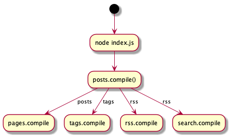

Just wanted to post a little something about my current blog generator.
Last night, I opened sourced my blog: https://github.com/patricksimpson/blog

## How does it work?

For now, all of the functionality is located in the lib directory.

    node index.js

Kicks off the post generator.

    const { postData, rssData, postTags } = await posts.compile(path.join(__dirname, dist));

[index.js - Line 12](https://github.com/patricksimpson/blog/blob/master/index.js#L12)

Provides data to the page, tag, rss, search generators. Each one has dependency injection.

 `postData`, `rssData`, `postTags`

Provides data to the page, tag, rss, search generators. Each one has dependency injection.

## AWS Deployment

Deployment alone is fine: `"push": "aws s3 cp build/ s3://patricksimpson.me/ --recursive",`

However, the subsquent requests are awful 🙈: https://github.com/patricksimpson/blog/blob/master/package.json#L19-L24

Also the build assets for production task is as well, has a massive amount of npm task chaining 😒.

    "deploy": "npm run push && npm run expires && npm run clearcache && cachebust --restore",
    "cachebust": "cachebust && npm run meta && npm run copy:dist"

More to follow!
