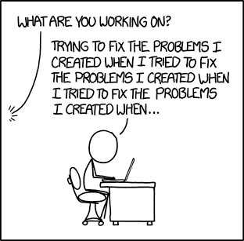

I've been running this blog on this [custom built JavaScript engine](https://github.com/patricksimpson/blog) for over 2 years. I've looked into other engines like [Jekyll](https://jekyllrb.com). The lift to Jekyll wasn't worth the time to me. I actually built almost everything Jekyll does without realizing it anyway... unless I was completely redesigning, it makes no sense to switch. 

It just works, it's static and my posts could be ported over if I really wanted to. Was this project a waste of time? 

Even if I am the only user, I don't believe it to be a waste. Some apps I've written for myself I still use.

For example, I still use this codepen application: [https://codepen.io/patricksimpson/full/dMLbgj](https://codepen.io/patricksimpson/full/dMLbgj). 

I use this simple app when I lift weights (and too lazy to do math). It works. It's not complicated, it's not pretty, but I still use it. If someone else uses it, that's great, if not, I am happy to continue.

If I am no longer using it, there is something to be said about the experience of building something, right? It's still not a complete waste.

**Software is about humans**, sometimes that is a solidary person. The experience, building muscle memory on building software is something I believe should be reinforced. 

At my day job, I work to ensure software is running optimally. My main concern is centered around data integrity. Discovering things (workarounds, hacks, etc) people are doing with the software, so that we can make the software better for everyone has become my passion. When I am not fixing a bug or a data problem, I am looking for paths and making software better, for humans.

Seeing those projects become real for others is thrilling! 

Software is about humans, whether it's just you or millions of people. You should be a user of your own software, find those things to make it better. 

*Build something*.
